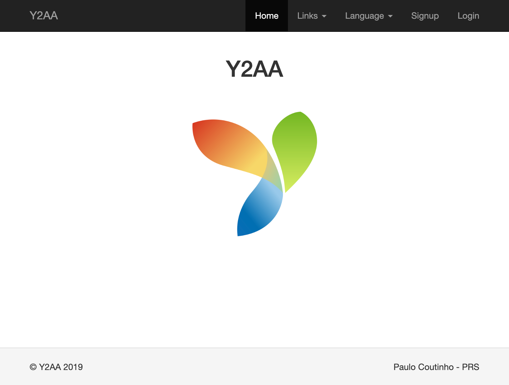

# Yii2 App Advanced

[](https://travis-ci.com/prsolucoes/yii2-app-advanced)  

This is a simple web system made with Yii2 with advanced features. The project has:
 
- Frontend with Boostrap 3
- Administration panel with AdminLTE
- Secure permission control for backend
- Secure permission control for API (using JWT)
- Simple CMS
- Customer areas (login, signup, recovery password, contact)
- Docker-compose configurations (nginx, mysql, php-fpm, memcached)
- Localizations for frontend and backend in english and portuguese
- Mobile, tablet and desktop friendly
- Upload for single file or multiple files configured
- Backend with specific report controller
- Configurations for development and production environment
- Ready implemented APIs : ping, login, signup, check token, request reset password, reset password, avatar  

This project is used in many other projects. It is ready to make a new website.



Other screenshots is here:  

[SCREENSHOTS](SCREENSHOTS.md)

## Commands

If you type "make" in your terminal, you get all options:

```
- help
- clear
- nginx-reload
- requirements

- migrate-db
- migrate-db-test

- create-db
- create-db-test

- docker-compose-start
- docker-compose-stop
- docker-compose-start-console
- docker-compose-rebuild

- config-env-development
- config-env-production

- composer-install
- composer-update
- composer-outdated
- composer-show
- composer-clear-cache

- test
```

If you want execute the commands with Docker support, add the parameter "docker=1" at the end of command. Ex:  
```
make migrate-db docker=1
```

If you have installed docker and docker compose, you have ready to use commands to start.

Use the following commands:

```
make docker-compose-start
make config-env-development
make migrate-db
```

All commands inside make use the docker names, like "y2aa_php_fpm". So you can execute "php" or "composer" like this:

```
docker exec -it y2aa_php_fpm php yii
``` 

or 

```
docker exec -it y2aa_php_fpm composer install
``` 

With docker you dont need install on your machine MAMP, XAMP or something like this. Docker is everything :p

All project configurations is using "yii2-app-advanced.local" as hosts (nginx and absolute URL in yii2 config files), so add in your "/etc/hosts" file:

```
127.0.0.1 yii2-app-advanced.local
```

## Apache2

If you use Apache2, you need add a virtual host, example:

```
<VirtualHost *:80>
    ServerName yii2-app-advanced.local

    #ErrorLog /var/log/apache2/advanced.local.error.log
    #CustomLog /var/log/apache2/advanced.local.access.log combined
    AddDefaultCharset UTF-8

    Options FollowSymLinks
    DirectoryIndex index.php index.html
    RewriteEngine on

    RewriteRule /\. - [L,F]

    DocumentRoot /var/www/yii2-app-advanced/frontend/web
    <Directory /var/www/yii2-app-advanced/frontend/web>
        AllowOverride none
        <IfVersion < 2.4>
          Order Allow,Deny
          Allow from all
        </IfVersion>
        <IfVersion >= 2.4>
          Require all granted
        </IfVersion>

        # if a directory or a file exists, use the request directly
        RewriteCond %{REQUEST_FILENAME} !-f
        RewriteCond %{REQUEST_FILENAME} !-d
        # otherwise forward the request to index.php
        RewriteRule ^ index.php [L]
    </Directory>

    # redirect to the URL without a trailing slash (uncomment if necessary)
    #RewriteRule ^/admin/$ /admin [L,R=301]

    Alias /admin /var/www/yii2-app-advanced/backend/web
    # prevent the directory redirect to the URL with a trailing slash
    RewriteRule ^/admin$ /admin/ [L,PT]
    <Directory /var/www/yii2-app-advanced/backend/web>
        AllowOverride none
        <IfVersion < 2.4>
            Order Allow,Deny
            Allow from all
        </IfVersion>
        <IfVersion >= 2.4>
            Require all granted
        </IfVersion>

        # if a directory or a file exists, use the request directly
        RewriteCond %{REQUEST_FILENAME} !-f
        RewriteCond %{REQUEST_FILENAME} !-d
        # otherwise forward the request to index.php
        RewriteRule ^ index.php [L]
    </Directory>
</VirtualHost>
```

## Contact

You can send email to me, to talk about anything related to the project:  
[paulo@prsolucoes.com](paulo@prsolucoes.com)

## Supported By Jetbrains IntelliJ IDEA


## Author WebSite

> http://www.pcoutinho.com

## License

[MIT](http://opensource.org/licenses/MIT)

Copyright (c) 2017-present, Paulo Coutinho